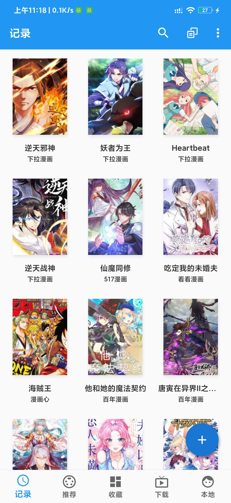
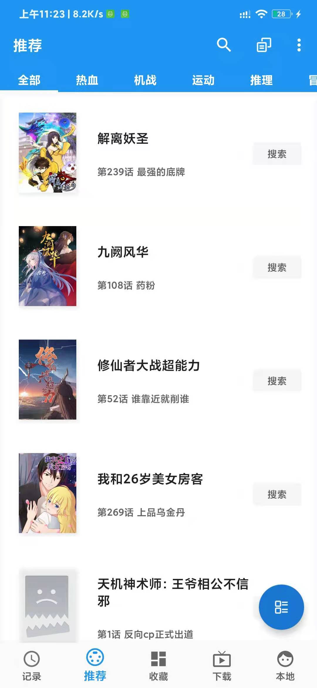
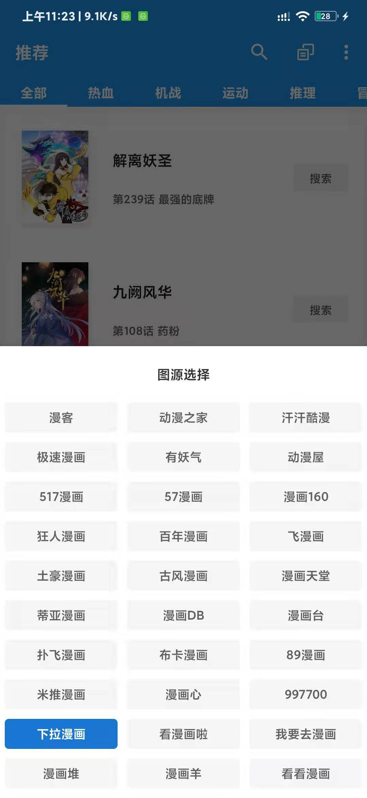
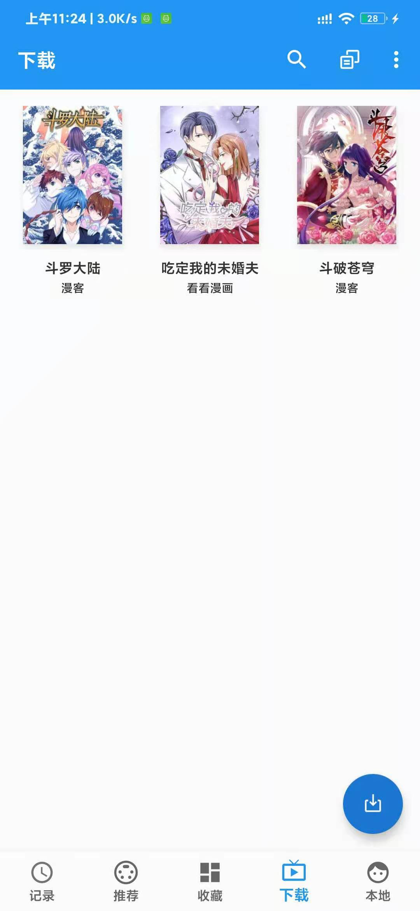
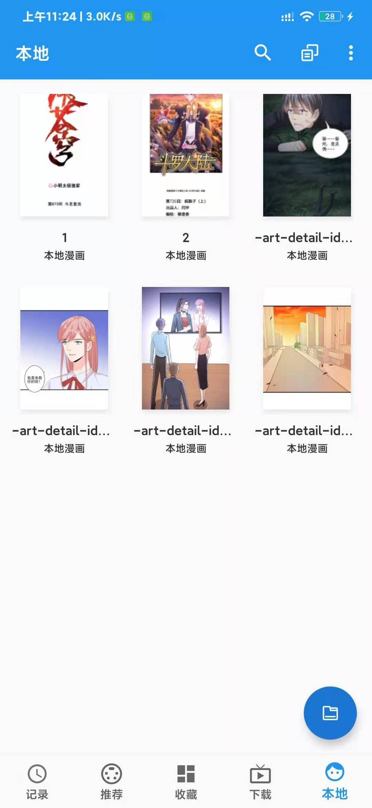

# 应用简介

Android 平台在线漫画阅读器, 基于cimoc项目进行二次开发项目，感谢原作者。
Online manga reader based on Android
Second development project based on cimoc project, thank the original author 111


# 下载
> 关于app下载，大家可以在蓝奏云上面进行下载，目前有3.0版本和1.6.6版本。其中这两个版本主要差别是在漫画源，3.0版本已经将漫画抽离出来了，我本身只能维护线上这些源，如果你有能力可以自己写源，并且导入，里面有测试。大家可以根据教程进行进行编写，源所用的依赖类，是基于cimoc中工具类，这些没变动。
> app的下载地址： [漫漫看](https://wws.lanzous.com/b01tpu2dg)
> 链接地址：https://wws.lanzous.com/b01tpu2dg


# 漫画源
> 各位大佬们提交漫画源相关issue，输入源名称，修改一下js代码，然后同步一下源就可以了，或者本地导入网络导入都行。

# 功能简介
- 漫画推荐（Cartoon recommendation）
- 翻页阅读（Page Reader）
- 卷纸阅读（Scroll Reader）
- 检查漫画更新（Check Manga For Update）
- 下载漫画（Download Manga）
- 本地漫画（Local Reader）
- 本地备份恢复（Local Backup）

# 软件使用说明
- 安装完成后，app中并没有数据，请先同步一下最新的漫画源，这样才有数据


# 应用截图







# 增加图源（欢迎pr）
- 关于开发新的图源，你可以参考项目中js，所有套路都是一样的，可能解析漫画地址的核心逻辑会不一样。整体逻辑都是一样，注意没个源sort是唯一的，请注意参考。
> 自己开发源后，本地导入，或者网络导入都行。
> 关于源书写教程
 ```js
 // 导入依赖包
importPackage(Packages.org.json)
importPackage(Packages.java.lang)

// 导入需要依赖的类
importClass(Packages.android.util.Log)
importClass(Packages.android.util.Pair)
importClass(Packages.java.util.ArrayList)
importClass(Packages.okhttp3.Request)
importClass(Packages.okhttp3.Headers)
importPackage(Packages.com.reader.comic.model)
importClass(Packages.com.reader.comic.utils.StringUtils)
importClass(Packages.com.reader.comic.soup.Node)
importClass(Packages.com.reader.comic.utils.StringUtils)

// 版本号
var version = 1.0;
// 是否启用
var enable = true;
// 源标题
var title = "动漫之家";
// 类型, 类型必须是唯一的，不然会导入失败
var sort = 2;

// 请求头, 可以用addHeader添加请求头
function getSearchRequest (keyword, page) {
    var url = "";
    if (page == 1) {
        url = "http://s.acg.dmzj.com/comicsum/search.php?s="+keyword;
    }
    return new Request.Builder().url(url).build();
}

//解析搜索页面: content是脚本注入
function getSearchIterator() {
    eval(content);
    var list = new ArrayList();
    for (var i = 0; i < g_search_data.length; i ++) {
        var object1 = g_search_data[i];
        var cid = object1.id;
        var title = object1.comic_name;
        var cover = object1.comic_cover;
        var author = object1.comic_author;
        list.add(new Comic(sort, cid, title, cover, null, author));
    }
    return list;
}
// 详情请求头
function getInfoRequest(cid) {
    var url = "http://v2.api.dmzj.com/comic/"+ cid +".json";
    return new Request.Builder().url(url).build();
}
// 解析详情
function parseInfo() {
    var object = new JSONObject(content);
    var title = object.getString("title");
    var cover = object.getString("cover");
    var time = object.has("last_updatetime") ? object.getLong("last_updatetime") * 1000 : null;
    var update = time == null ? null : StringUtils.getFormatTime("yyyy-MM-dd", time);
    var intro = object.optString("description");
    var sb = new StringBuilder();
    var array = object.getJSONArray("authors");
    for (var i = 0; i < array.length(); ++i) {
       sb.append(array.getJSONObject(i).getString("tag_name")).append(" ");
    }
    var author = sb.toString();
    var status = object.getJSONArray("status").getJSONObject(0).getInt("tag_id") == 2310;

    var comic = new Comic(sort, "");

    comic.setInfo(title, cover, update, intro, author, status);
    return comic;
}


// 解析章节
function parseChapter () {
    var list = new ArrayList();
    var object = new JSONObject(content);
    var array = object.getJSONArray("chapters");
    for (var i = 0; i != array.length(); ++i) {
        var data = array.getJSONObject(i).getJSONArray("data");
        for (var j = 0; j != data.length(); ++j) {
            var chapter = data.getJSONObject(j);
            var title = chapter.getString("chapter_title");
            var path = chapter.getString("chapter_id");
            list.add(new Chapter(title, path));
        }
    }

   return list;
}

// 请求漫画展示详情
function getImagesRequest(cid, path) {
    var url = StringUtils.format("http://v2.api.dmzj.com/chapter/%s/%s.json", cid, path);
    return new Request.Builder().url(url).build();
}

// 图片请求头： 必须要有
function getHeader () {
    return Headers.of("Referer", "http://m.dmzj.com/");
}
function getHeader2(url) {
    return getHeader();
}
function getHeader3 () {
    return getHeader ();
}

// 解析图片
function parseImages() {
    var list = new ArrayList();
    var object = new JSONObject(content);
    var array = object.getJSONArray("page_url");
    for (var i = 0; i < array.length(); i++) {
        Log.d("图片地址", array.getString(i));
        list.add(new ImageUrl(i + 1, array.getString(i), false));
    }
    return list;
}

// 获取分类
function get_subject () {
    var list = new ArrayList();
    var url = "http://m.dmzj.com/classify/%s-0-0-0-0-%%s.json";
    list.add(Pair.create("全部", StringUtils.format(url, "0")));
    list.add(Pair.create("冒险", StringUtils.format(url, "1")));
    list.add(Pair.create("欢乐向", StringUtils.format(url, "2")));
    list.add(Pair.create("格斗", StringUtils.format(url, "3")));
    list.add(Pair.create("科幻", StringUtils.format(url, "4")));
    list.add(Pair.create("爱情", StringUtils.format(url, "5")));
    list.add(Pair.create("竞技", StringUtils.format(url, "6")));
    list.add(Pair.create("魔法", StringUtils.format(url, "7")));
    list.add(Pair.create("校园", StringUtils.format(url, "8")));
    list.add(Pair.create("悬疑", StringUtils.format(url, "9")));
    list.add(Pair.create("恐怖", StringUtils.format(url, "10")));
    list.add(Pair.create("生活亲情", StringUtils.format(url, "11")));
    list.add(Pair.create("百合", StringUtils.format(url, "12")));
    list.add(Pair.create("伪娘", StringUtils.format(url, "13")));
    list.add(Pair.create("耽美", StringUtils.format(url, "14")));
    list.add(Pair.create("后宫", StringUtils.format(url, "15")));
    list.add(Pair.create("萌系", StringUtils.format(url, "16")));
    list.add(Pair.create("治愈", StringUtils.format(url, "17")));
    list.add(Pair.create("武侠", StringUtils.format(url, "18")));
    list.add(Pair.create("职场", StringUtils.format(url, "19")));
    list.add(Pair.create("奇幻", StringUtils.format(url, "20")));
    list.add(Pair.create("节操", StringUtils.format(url, "21")));
    list.add(Pair.create("轻小说", StringUtils.format(url, "22")));
    list.add(Pair.create("搞笑", StringUtils.format(url, "23")));
    return list;
}

// 请求漫画展示详情
function getCategoryRequest(format, page) {
    var url = StringUtils.format(format, page);
    return new Request.Builder().url(url).build();
}

//解析推荐
function parseCategory() {
    var list = new ArrayList();
    var array = new JSONArray(content);
    Log.d("网页", content);
    for (var i = 0; i != array.length(); i++) {
        var object = array.getJSONObject(i);
//        Log.d("分类地址", "http://images.dmzj.com/".concat(object.getString("cover")));
        if (object.optInt("hidden", 1) != 1) {
            var cid = object.getString("id");
            var title = object.getString("name");
            var cover = "https://images.dmzj.com/".concat(object.getString("cover"));

            var time = object.has("last_updatetime") ? object.getLong("last_updatetime") * 1000 : null;
            var update = time == null ? null : StringUtils.getFormatTime("yyyy-MM-dd", time);
            var author = object.optString("authors");
            list.add(new Comic(sort, cid, title, cover, update, author));
        }
    }
    return list;
}

// 每个源所依赖的包或者类必须导入，每个源中函数名称都是一样的，核心逻辑也都类似，参照现有源基本可以构建新的源

 ```

## cimoc设置
- 阅读模式－翻页模式-卷纸模式
- 定义点击事件－左上－上一页，右下下一页
- 自定义长按点击事件-切换阅读模式
- 启用快速翻页（减少）
- 自动裁剪百边
- 禁止双击放大
- 启用通知栏


# 软件更新方向：
- 能正常搜索解析网络上大部分免费的漫画
- 界面简洁为主
- 解决apk影响体验的问题


# 免责声明：
- 如果更新软件的过程中有什么侵权的地方，请在github上留言或者私信我，提供相关版权证明，会马上删除侵权部分的内容。
- 本软件开发，是为了码农之间的技术交流，以及解决软件测试过程中出现的各种bug。
- 后期如进行到了服务器的开发，会开个新分支公开服务器开发所用的代码，以及公开服务器内存放的所有内容，
- 本软件不以盈利为目的，广告收入全部用于服务器维护和开发。
